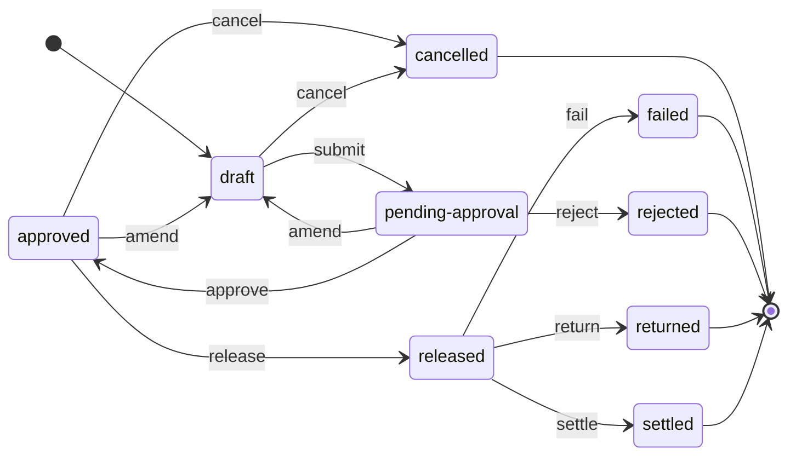

# CloFin — Domain Model

**Status:** living document · **Applies to:** all contexts

This is the shared vocabulary. Terms defined here mean the same thing in the
code, the API contract, the tests and every conversation about the product.
Where a word is commonly used loosely in payments, the definition below says
which sense CloFin means — and, where it matters, which sense it does not.

> Synthetic data only. No entity, account or counterparty described here
> corresponds to anything real.

Legend: **✅ built** · **🔨 in progress** · **📋 specified, not built**

---

## 1. Ubiquitous language

| Term | Definition | Not to be confused with |
|---|---|---|
| **Organisation** | A tenant. Every business record belongs to exactly one. | The legal entity being paid — that is a Counterparty. |
| **Ledger Account** | An internal account in the double-entry ledger, holding one currency. | A bank account. CloFin's ledger accounts are internal; a bank account is an External Account. |
| **External Account** | An account at a financial institution, identified by scheme-specific details. | A Ledger Account. |
| **Counterparty** | A party CloFin pays or is paid by. | A user of the system. |
| **Payment Instruction** | A request to move money, with a lifecycle. Mutable while `draft`; immutable in substance thereafter. | A Journal Entry. The instruction is the intent; the entry is the accounting fact. |
| **Journal Entry** | One economic event, recorded as two or more balancing lines. Immutable once posted. | A Payment Instruction. One instruction typically produces several entries over its life. |
| **Journal Line** | One account's participation in an entry: a direction and a positive amount. | A "transaction". |
| **Posting** | The act of writing a journal entry. | Sending money. Posting is an accounting act; release is a payment act. |
| **Balance** | Derived by aggregating an account's journal lines. Never stored as authority. | A stored figure. There isn't one. |
| **Maker** | The actor who creates an instruction **and the only actor who may submit it** — enforced by `clofin.payments.state/creator-only-events` and `clofin.payments.repository/transition!`, not merely stated here. Without that enforcement, "creates and submits" is two actors described as one, and the Checker rule below stops being a control. | The beneficiary. |
| **Checker** | The actor who approves. Must not be the maker — refused by `clofin.authz.approval/evaluate`, which compares the approver against `created-by` and relies on the Maker row above for that to be the whole comparison. | A reviewer with no system authority. |
| **Release** | The act of handing an approved instruction to settlement. | Approval. Approval permits release; it is not release. |
| **Settlement** | Irrevocable transfer of value through a scheme. | Clearing, which is the exchange of instructions preceding it. |
| **Reversal** | A new entry mirroring an original, leaving both visible. | Deletion, amendment, or "cancellation" of a posted entry — none of which exist. |
| **Return** | A payment sent back by the receiving institution after settlement. | A Refund, which CloFin's own user initiates. |
| **Statement** | A **simulated** scheme's account of what it did over a period, in CloFin's own versioned format. | A real bank statement format. CloFin reads no camt.053, MT940 or BAI2, and connects to nothing. |
| **Statement Line** | One movement a statement reports: a settlement or a return, with a reference, an amount and a value date. | A journal line. A statement line is somebody else's claim; a journal line is CloFin's record. |
| **Expected Movement** | What CloFin's **own journal** records on the reconciled account for the period — the other side of a reconciliation. | A statement line. They are compared precisely because different things produced them. |
| **Match** | A statement line bound to one expected movement, recording **which rule** bound them. | Agreement. A match says the two records are about the same movement; whether they *agree* is a separate question, and a matched pair that disagrees is a break. |
| **Break** | A reconciliation item that did not match, with an age and an owner. | A discrepancy that someone will look at later. A break is a tracked object. |
| **Adjustment** | A new, balanced, approved journal entry that resolves a break. | An edit. Nothing in CloFin edits a posted entry, ever. |
| **Idempotency Key** | A caller-supplied identifier making a retry safe. | A payment reference. |
| **Audit Event** | An append-only record of a state change: who, what, when, before/after **as digests**. | An application log line. Also not a copy of the record — a digest proves a value, it does not carry one. |
| **Actor** | A person or system able to act within one organisation, holding roles and per-currency approval limits. | An Organisation, which is the tenant the actor acts within. |
| **Role** | A named bundle of permissions. Five exist and none of them is a superuser. | A job title. A role here is exactly its permission set. |
| **Permission** | A single verb an actor may exercise. **Absent means denied**, always. | A preference or a UI affordance. |
| **Approval Threshold** | A band of amounts, in one currency, and how many approvals it requires. Lower bound inclusive. | A limit. A threshold is the organisation's rule; a limit is one approver's ceiling. |

---

## 2. Entities

### 2.1 Ledger context ✅

```
Organisation 1───* LedgerAccount
                        │
                        *
                        │
JournalEntry 1───* JournalLine
     │
     └── reverses ──▶ JournalEntry (0..1, at most once)
```

**LedgerAccount** ✅
| Field | Type | Notes |
|---|---|---|
| `id` | UUID | |
| `organisation-id` | UUID | |
| `code` | string | Uppercase alphanumeric and hyphens, unique per organisation. Appears in exports. |
| `name` | string | |
| `type` | `:asset` `:liability` `:equity` `:revenue` `:expense` | Determines the normal balance side. |
| `currency` | ISO 4217 | An account holds exactly one currency. |
| `status` | `:active` `:frozen` `:closed` | Only `:active` accepts postings; history stays readable in all states. |

**JournalEntry** ✅
| Field | Type | Notes |
|---|---|---|
| `id` | UUID | |
| `organisation-id` | UUID | |
| `occurred-at` | instant | When the economic event happened — supplied by the caller, not read from a clock. |
| `recorded-at` | instant | When CloFin learned of it. The two differ, and both matter. |
| `narrative` | string | Required. A movement without an explanation is not acceptable. |
| `reference` | `{:type … :id UUID}` | The business object that caused the movement. Required. |
| `reverses-id` | UUID? | Set on a reversal. An entry may be reversed at most once. |
| `lines` | JournalLine[] | At least two; debits equal credits per currency. |

**JournalLine** ✅
| Field | Type | Notes |
|---|---|---|
| `account-id` | UUID | |
| `direction` | `:debit` `:credit` | Explicit; the sign is never encoded in the amount. |
| `amount` | Money | Strictly positive. |

**Money** ✅ — `{:currency "SGD" :minor-units 125000}`. Integer minor units
against an ISO 4217 scale. Never floating point.
See [ADR-0003](ADR/0003-money-as-integer-minor-units.md).

### 2.2 Payments context 🔨

**PaymentInstruction** 🔨
| Field | Notes |
|---|---|
| `id`, `organisation-id` | ✅ |
| `debtor-account-id` | A LedgerAccount. ✅ Must be `active` and hold the instruction's currency. |
| `creditor-name`, `creditor-account` | ✅ Counterparty and External Account details, synthetic. |
| `amount` | Money. ✅ |
| `value-date` | Requested settlement date. ✅ A calendar date, not an instant. |
| `purpose-code` | Constrained vocabulary; several corridors require one. ✅ |
| `status` | See §3. ✅ |
| `created-by`, `created-at` | ✅ `created-by` is caller-asserted until TASK-003 delivers authentication. |
| `reverses-id` | ✅ Set on an instruction raised to reverse a settled one. |
| `retries-id` | ✅ Set on an instruction raised to **retry** a returned one, and never afterwards — the database refuses a change to it. The reference ADR-0019 deferred and [ADR-0024](ADR/0024-a-retry-names-the-returned-payment-it-replaces.md) built. It relates the two records and confers nothing: the retry is submitted and approved on its own merits, and carries no value rule against the original, because correcting a beneficiary or an amount is the ordinary reason to retry. Mutually exclusive with `reverses-id`. |
| `retried-by-ids` | ✅ The other end, **derived at read time** from the retries themselves rather than stored, so the two ends cannot disagree. A list: the link carries no uniqueness rule (ADR-0024), and the ordinary case has one member. |
| `screening-outcome` | 📋 Reference to the screening decision that permitted approval. Increment 7. |

**IdempotencyKey** ✅ — `(organisation-id, key)`, with the digest of the request
and the response it produced.

Modelled as a **record of its own** rather than as a field on the instruction,
because the key protects *every* mutating operation — a submission, an
amendment, a cancellation — and not only the creation of an instruction. A key
that lived on `payment_instruction` could make creation idempotent and nothing
else, which would leave submission unprotected: precisely the operation whose
timeout the control exists for. See
[C-06](COMPLIANCE.md) and
[ADR-0013](ADR/0013-canonical-request-digest-for-idempotency.md).

**Approval** ✅
| Field | Notes |
|---|---|
| `id` | ✅ An approval is addressable: it can be withdrawn and it appears in an evidence pack on its own. |
| `instruction-id`, `actor-id` | ✅ The actor is the authenticated principal, not a caller assertion. |
| `decision` | ✅ `approved` or `rejected`. No default — the safe default would have to be one of the two, and either is a decision nobody made. |
| `reason` | ✅ Mandatory on a rejection and retained (PR-013). Enforced twice: the domain produces the `422` naming the field, and `approval_rejection_needs_reason` makes a reasonless rejection unrepresentable. |
| `decided-at` | ✅ |
| `invalidated-at` | ✅ Set when the instruction was amended (PR-014) or the actor withdrew the approval. **The row is never deleted** — the database refuses it. An approval that was given and then invalidated is exactly the history an investigation needs; a deleted one is a decision nobody can prove was taken. |

### 2.3 Settlement context ✅

```
SettlementBatch 1───* SettlementBatchItem *───1 PaymentInstruction
        │
        └──* SchemeResponse
```

**SettlementBatch** ✅
| Field | Notes |
|---|---|
| `id`, `organisation-id` | ✅ |
| `scheme` | ✅ `SIM-RTGS` or `SIM-ACH`. **Simulated only** — the `SIM-` prefix is a database check constraint, so a synthetic record can never name a real network. An operator's routing choice: an instruction carries no scheme attribute. |
| `currency`, `value-date` | ✅ With `scheme`, the triple that defines a batch. One batch, one triple. |
| `status` | ✅ `open` → `submitted` → `settled` / `partially-settled` / `failed`. **Derived from the items' outcomes**, never set directly — the same doctrine as a balance deriving from the journal. Reaching a terminal value emits `settlement-batch.completed`; a **late** `timeout-resolution` that moves it again emits `settlement-batch.status-restated`, which is a different transition and therefore a different term (§2.6). |
| `created-by`, `created-at` | ✅ |

**SettlementBatchItem** ✅ — one instruction within a batch, keyed
`(batch, instruction)` and having no identity of its own.
| Field | Notes |
|---|---|
| `outcome` | ✅ `settled`, `returned`, `timed-out`, or null while pending. There is deliberately **no `failed`** — see §3. |
| `outcome-reason` | ✅ Required on a `returned` item: an exception queue whose entries do not say why is one nobody can work. |
| `resolved-at` | ✅ Set exactly once. |

**A settlement membership is permanent.** ✅ An instruction is in **at most one**
membership, ever — pending, settled, timed out and returned all block a second
one — and that is a unique index rather than a check in application code, so it
binds a fix-up script and a defect too. **`timed-out` blocks precisely because
the outcome is unknown:** treating unknown as failed and re-batching is how a
payment is made twice, which is the single failure this context exists to
prevent.

`returned` used to be the exception, and audit finding **F-007** removed it. The
schema freed a returned instruction for re-batching while the payment lifecycle
held `returned` terminal and batch eligibility was `approved`-only — so the
permission the index advertised was unreachable from any public command, and the
acceptance criterion promising it was false end to end (standing lesson
**L-10**: a schema path is not a product path). **Ruled: `returned` is terminal;
a retry is a NEW instruction** — the doctrine `settled` already follows in §3
rule 4, where a correction is a new reversing instruction rather than a mutation
of the old one. Migration `0010` tightened the index accordingly. Linked-retry
provenance — a reference relating the retry to the payment it replaces, and the
exception workflow around it — was ADR-0019's named, deferred cost and is
**built**: `payment_instruction.retries_id`, immutable at the database, visible
from both ends of the link, carried on the retry's own creation event, and named
by any reconciliation break on the original
([ADR-0024](ADR/0024-a-retry-names-the-returned-payment-it-replaces.md)).

**SchemeResponse** ✅ — what a simulated scheme said, stored **verbatim** as a
**receipt**, kept whether or not it caused work.

| Field | Notes |
|---|---|
| `kind`, `reference` | ✅ With batch and instruction, the **replay key** — `nulls not distinct`, so two identical batch-level acks collide rather than coexisting. It names a delivery's *identity*. |
| `request-digest` | ✅ Version-tagged canonical digest of the **complete semantic request** — batch, instruction, kind, reference, outcome and reason. It says whether two deliveries under one identity are the same *message*. Same canonicaliser and same posture as `idempotency_key` ([ADR-0013](ADR/0013-canonical-request-digest-for-idempotency.md)). |
| `disposition` | ✅ `applied`, `acknowledged` or `refused` — what CloFin did about the arrival, machine-readable. |
| `disposition-reason` | ✅ Required on a refusal, absent otherwise: `item-already-resolved`, `item-not-timed-out`, `item-not-in-batch`. |
| `outcome`, `reason` | ✅ What this response **claimed**. Distinct from `SettlementBatchItem.outcome`, which is what CloFin **recorded** — the two differ in exactly the case that matters, a message kept as evidence that did no work. |

Append-only against all three destructive verbs, and — since audit finding
**F-008** — genuinely kept whether or not it caused work. It was not before: a
response CloFin could not act on was rolled back *by the conflict that rejected
it*, so the first delivery was unprovable and the identical reference could
perform work later against changed state. Receipt and disposition are separate
facts (standing lesson **L-11**): the receipt commits with a machine-readable
statement of what was done, and the `409` is rendered afterwards.

Responses arriving **late, twice, or out of order** is the normal case in the
world this simulates, not an edge case; so is **partial batch failure**.

- An **exact duplicate** — same identity, same digest — does no work and
  reproduces the original answer, `outcome` included.
- The **same reference saying something different** is a conflict and is never
  called a replay. Audit finding **F-009** (standing lesson **L-12**, extending
  L-2) found two contradictory timeout resolutions sharing one identity, the
  second answered `200 replayed=true`; replay identity now covers every
  effect-bearing field.
- A genuinely **new response for an item that already has an outcome** is a
  conflict — and its receipt is kept.

### 2.4 Reconciliation context ✅

```
ReconciliationStatement 1───* StatementLine 1───0..1 Match ───1 JournalEntry
        │                            │
        └──────* Break *─────────────┘
                  │
                  └──* Adjustment ───0..1 JournalEntry
```

**ReconciliationStatement** ✅ — one arrival of one synthetic statement, kept
whether or not CloFin could process it.

| Field | Notes |
|---|---|
| `format`, `format-version` | ✅ `SIM-CLOFIN-RECON-STATEMENT`, version 1. **CloFin's own format, and deliberately not any real one** — not camt.053, MT940, BAI2 or any scheme's or bank's schema. A synthetic-data project parsing a real bank format would be fidelity theatre. See [ADR-0023](ADR/0023-a-clofin-defined-synthetic-statement-format-and-an-ordered-matching-sequence.md). |
| `scheme`, `currency` | ✅ `SIM-` prefixed, from the same vocabulary a settlement batch uses. The scheme is **provenance, not a selector**: the account reconciled is `1300-IN-TRANSIT` in the currency, whichever simulated scheme sent the statement. |
| `statement-reference` | ✅ The delivery's **identity** within an organisation. Two deliveries carrying it are two deliveries of one document. |
| `content-digest` | ✅ Version-tagged canonical digest of the **complete semantic content** — scheme, currency, period and every line. It says whether two deliveries under one identity are the same *message*. Same canonicaliser and same posture as `idempotency_key` and `scheme_response` ([ADR-0013](ADR/0013-canonical-request-digest-for-idempotency.md), lessons L-2 and L-12). |
| `period-start`, `period-end` | ✅ Half-open `[start, end)`, so consecutive statements chain exactly. |
| `disposition` | ✅ `applied` or `refused` — what CloFin did about the arrival, machine-readable. |
| `disposition-reason` | ✅ Required on a refusal, absent otherwise: `no-reconciled-account`, `too-many-ledger-movements`. |
| `reconciled-account-id` | ✅ Null exactly when the statement was refused for want of one. |

**Receipt and disposition are separate facts** (standing lesson **L-11**). A
statement CloFin cannot process is recorded as having arrived, with a
machine-readable reason, and the caller's refusal is rendered only after that
receipt commits. Append-only against all three destructive verbs.

**StatementLine** ✅ — one movement the simulated scheme reports, addressed by
`(statement, position)` and having no identity of its own.

| Field | Notes |
|---|---|
| `line-no` | ✅ Assigned by CloFin from 1 on arrival, never read from the document: position is how a break addresses a line. |
| `scheme-reference` | ✅ The scheme's own reference for the line. |
| `payment-reference` | ✅ The end-to-end reference the scheme echoed back — CloFin's instruction id. **Null is a real case**, not missing data: an untagged line is matched on its attributes instead, by rule R4. |
| `line-type` | ✅ `settlement` or `return`. There is deliberately **no release line**: a release is CloFin telling the scheme something. |
| `amount`, `value-date` | ✅ The value date is the day the scheme dates the movement to. |

**Match** ✅ — one line bound to one journal entry, recording **which rule**
bound them (PR-051). One movement is claimed by at most one line, which is a
unique index rather than a check in application code — and it is why a second
claim becomes a break rather than a second match. The rule sequence is §6.

**Break** ✅ — a reconciliation item that did not match, or matched and
disagreed: a *tracked object* with an owner and an age.

| Field | Notes |
|---|---|
| `kind` | ✅ One of six, covering **both directions** and the three ways a matched pair can still disagree — see §6. |
| `state` | ✅ `open` → `investigating` → `resolved`. Held as data in `clofin.recon.break-state`, enforced at the service boundary; an illegal transition is a `409` naming what would have been permitted. **Drawn:** [`diagrams/reconciliation-break-lifecycle.md`](diagrams/reconciliation-break-lifecycle.md), generated from that table. |
| `assignee` | ✅ **A break is never unowned.** It opens assigned to the actor whose ingestion discovered it, and may be reassigned while it is open or investigating. Assigning an `open` break *is* the move to `investigating`. |
| `age` | ✅ **Derived from `opened-at` at read time and stored nowhere.** A stored age is wrong the moment it is written, for the same reason a stored balance is (ADR-0008). |
| `detail` | ✅ What disagreed, in words: the two amounts, the two dates, or the movement the other side does not have. |

**Adjustment** ✅ — the only way a disagreement changes the books.

| Field | Notes |
|---|---|
| `amount`, `direction` | ✅ The direction applies to the **reconciled** account; the suspense leg (`2200-UNAPPLIED`) is always the opposite, so the entry balances by construction. |
| `narrative` | ✅ Required: an entry between a clearing account and a suspense account that does not say why is the entry an investigation can least read. |
| `approvals-required` | ✅ Computed from the organisation's own `approval_threshold` bands **at proposal** and stored, so lowering a band later cannot post an adjustment that never cleared the bar it was raised under. |
| `status`, `entry-id` | ✅ `proposed` → `posted`, **or** `proposed` → `rejected`. Both endings are terminal and are held as data in `clofin.recon.adjustment/transitions`, with the terminal set derived rather than listed. **Drawn:** [`diagrams/reconciliation-adjustment-lifecycle.md`](diagrams/reconciliation-adjustment-lifecycle.md), generated from that table. At most one *posted* adjustment per break, by partial unique index — a rejected one is outside the predicate, which is why a refused correction does not block a different one. |
| the refusal | ✅ An approver other than the proposer may **reject** an adjustment, with a mandatory reason. Who, why and when are the `approval` row the decision wrote — the same place, and the only place, a rejected payment keeps them — and the adjustment's own `reconciliation-adjustment.rejected` event marks it terminal. The break is left in the state it was already in, because proposing an adjustment never moved it. |

**Nothing in reconciliation edits a journal entry, ever** (C-03). An adjustment
is a *new* balanced entry posted through the existing path —
`clofin.ledger.service/post-entry!`, with the same zero-sum check, the same
account lock, the same deferred trigger and the same `journal-entry.posted`
event. Above the lowest band an organisation configured for the currency it
needs that band's approvals from actors who are **not** its proposer, through
`clofin.authz.approval/evaluate` and the same `approval` table a payment uses;
below it one actor suffices; and an organisation with **no** band in the
currency cannot adjust at all, because treating "unconfigured" as "needs
nobody" is how a control silently weakens.

**What the two sides are, and why they are produced by different things.** The
statement is the *scheme's* account of what it did, generated by
`clofin.settlement.statement` from the settlement records. The expectations are
*CloFin's*, read by `clofin.recon.repository/expectations-for` from the
**journal** — the posted amount, the entry's occurrence date, and the
counter-account that says whether a movement was a settlement or a return.
Nothing they agree about was derived from the other (standing lesson **L-16**).

**The clearing account is the point.** `1300-IN-TRANSIT` holds, at any instant,
the value CloFin has released and does not yet know the fate of (ADR-0018). A
payment the scheme never answered about is correctly still in that balance
*and* correctly absent from every statement — that pair is what the model is
for, not an edge case.

**Linked-retry provenance is built, and a break is where it is read.**
[ADR-0019](ADR/0019-a-returned-payment-is-terminal-and-retries-as-a-new-instruction.md)
ruled that a reference relating a retry to the payment it replaces belongs to
this context, where return-exception handling natively lives; increment 6
delivered the half that made the gap dangerous — because a statement line's
`payment-reference` is the *instruction* id, a line about the original and a
line about its retry can never be confused for one another — and TASK-010
delivered the reference and the workflow that reads it
([ADR-0024](ADR/0024-a-retry-names-the-returned-payment-it-replaces.md)).

Every break therefore names, **derived at read time and stored nowhere**, the
payment instruction it is about and any instruction raised to retry that
payment. Both come from whichever side of the disagreement the break has: the
ledger entry's reference, or the statement line's end-to-end reference. An
investigator holding a break about a payment that came back can see whether it
was raised again without matching counterparty and amount by eye.

### 2.5 Compliance context 📋

**ScreeningResult** — outcome, matched list entries, and the *list version*.
Without the version, a past decision cannot be reproduced.
**FraudAssessment** — score, contributing reasons, and the rule-set version.
**Case** — an alert requiring human disposition, with rationale retained.

### 2.6 Audit context ✅ (payments and approvals)

**AuditEvent** ✅ — `actor`, `action`, `subject-type`, `subject-id`,
`before-digest`, `after-digest`, `correlation-id`, `occurred-at`. Append-only,
written in the same transaction as the change it describes.

**Digests, not payloads.** An event proves *that* something changed, and *what*
it changed to when compared against a value the auditor already holds. It does
not carry the counterparty name: an append-only table holding one is a second
copy of the data C-09 minimises, and it can never be cleaned. Each digest is
prefixed with the canonicalisation version that produced it. See
[ADR-0016](ADR/0016-audit-events-store-digests-not-payloads.md), which also
states what this costs an auditor.

**Coverage.** Every state change the API can perform emits one event: payment
instructions, approvals, settlement batches, reconciliation statements, breaks
and adjustments, and — since TASK-005 — organisation creation, account opening
and journal posting. **No qualification remains on [C-05](COMPLIANCE.md)**, and
this paragraph says so only because the two facts behind it are now true rather
than because it reads better.

The qualification that stood until TASK-010 was a late `timeout-resolution`
recomputing an already-complete batch's derived status: the instruction's own
transition was recorded in that transaction and nothing named the batch. That
recomputation now emits `settlement-batch.status-restated` — a term distinct
from `settlement-batch.completed`, because `completed` marks the transition
*into* a complete batch and a second move is not one — and it is emitted only
where the derived status actually moves.

**The history is kept rather than tidied away**, because it is the more useful
half. This paragraph once said "there is no qualification left on C-05" while
the qualification was disclosed later in COMPLIANCE itself; the `ref-1` release
audit recorded that as finding **A-004**, the headline was corrected to agree
with the disclosure (standing lesson **L-14**), and the disclosure has now been
closed on every copy of it. A reader comparing this document with that audit
should be able to find all three steps.

**Attribution, including where there is none.** `actor` is null on exactly one
action, `organisation.created`, because `POST /organisations` is the bootstrap
and no actor can exist before the organisation that holds one. That is enforced
rather than conventional: `clofin.audit/event` refuses a null actor for every
action outside `clofin.audit/bootstrap-actions`
([ADR-0017](ADR/0017-bootstrap-identity-for-organisation-creation.md)).

**Vocabulary.** The action is drawn from a closed set (`clofin.audit/actions`);
anything else is refused before it reaches the table, so a question like "show
me every approval in August" has a complete answer rather than a best-effort
one. Two naming rules hold, both of them corrections from Milestone 1's audit:

| | |
|---|---|
| `payment.created`, `payment.submitted`, `payment.approved`, `payment.rejected`, `payment.amended`, `payment.cancelled` | The **payment's** transitions. Each is emitted exactly once, in the transaction where that transition commits — finding **F-005** found `payment.approved` emitted per *decision*, so a two-approval payment appeared to have been approved twice. |
| `approval.recorded`, `approval.withdrawn`, `approval.invalidated` | The **approval's** own lifecycle, with the approval as subject. `approval.recorded` is written for every decision, approve or reject. `approval.invalidated` is written per approval when an amendment revokes it — finding **F-006**; before it, the trail said only that the payment had been amended. |
| `payment.released`, `payment.settled`, `payment.returned` | Settlement's payment transitions, each written where that transition commits. `payment.released` is one event **per instruction** in the batch's submission transaction — counting `settlement-batch.submitted` to learn how many payments left would be F-005's mistake with a new name. `payment.failed` is in the vocabulary and is emitted by nothing; see §3. |
| `settlement-batch.created`, `.submitted`, `.completed`, `.timeout-swept` | The **batch's** own lifecycle, with the batch as subject. `.completed` is written **only** in the transaction where the last unresolved item resolves — a batch with items outstanding is not completed however many responses have arrived. `.timeout-swept` is its own term because "we stopped waiting" is not "the scheme answered", and a sweep that swept nothing writes nothing. |
| `organisation.created`, `account.created`, `journal-entry.posted` | The three writes that emitted nothing until TASK-005. Each is a creation, so each is written once, in the transaction where the row it names first exists, with a null before-digest. None has a decision or a partial step to distinguish it from, so none needs a second term the way `approval.recorded` needed one beside `payment.approved`. `posted` rather than `created` for a journal entry: an entry is never drafted and never amended (C-03), so posting is the only transition it has. |

An approval's events name the approval, not the payment, because that is what
they are about. `clofin.audit.repository/events-for-payment` relates them back
through `approval.instruction_id`, so a payment's evidence pack still shows
them without the subject column having to misdescribe them.

### 2.7 Authorisation context ✅

**Actor** ✅ — `id`, `organisation-id`, `display-name`, `status`
(`active`/`suspended`), with roles and per-currency approval limits. Seeded, not
self-registered: an actor that could grant itself the approver role would make
segregation of duties unenforceable however carefully the rule is written.

**Role** ✅ — one of `operator`, `approver`, `controller`, `compliance`,
`auditor`. What each *means* is `clofin.authz.model/role-permissions`, in code
rather than in rows: a permission set stored as data is editable by anyone able
to write those rows. **There is no superuser**, and a test asserts that no role
holds every permission.

**ApproverLimit** ✅ — the largest amount an actor may approve, per currency.
Absent means zero, not unlimited.

**ApprovalThreshold** ✅ — amount bands mapping to a required approval count,
per organisation and per currency. `from-minor` is inclusive, so an amount
exactly on a boundary falls in the higher band. A currency with no bands cannot
have payments approved at all. See
[ADR-0015](ADR/0015-approval-thresholds-are-per-currency.md), which resolves
PRD Q1.

---

## 3. Payment instruction lifecycle 🔨

<!-- BEGIN GENERATED: payment-lifecycle -->

> **Generated.** This diagram is produced from
> `clofin.payments.state/transitions` by `clofin.tools.diagrams` and checked
> by `make diagrams-check`, per
> [ADR-0020](ADR/0020-two-repositories-and-the-generate-replay-rules.md) RULE 1.
> Editing it here is pointless: the next `make diagrams` overwrites it, and
> the build fails in between. The standalone artifact is
> [`diagrams/payment-lifecycle.md`](diagrams/payment-lifecycle.md).



<!-- END GENERATED: payment-lifecycle -->

`amend` leaves **two** states — `pending-approval` and `approved` — and both
land back in `draft`, invalidating every approval given so far. The drawing
above is **generated from** `clofin.payments.state/transitions`, which carries
eleven permitted pairs, so it can no longer disagree with the table — the
failure [ADR-0014](ADR/0014-payment-lifecycle-as-data.md) exists to prevent,
and the failure this diagram *was*, by hand, until ruling O-2 (lesson **L-4**).
It was hand-maintained with a note asking a reader to compare it against the
table; [ADR-0020](ADR/0020-two-repositories-and-the-generate-replay-rules.md)
RULE 1 replaced the note with `make diagrams-check`.

One arrow the hand-drawn version carried is deliberately absent: `reverse`,
from `settled` to a new instruction. It was never a transition — rule 4 below
and `clofin.payments.state/reversible-states` say a settled instruction is
never mutated — so a generated drawing of the transition table cannot contain
it. That the drawing used to show it, and now cannot, is the point.

**This closes half of L-4, not the lesson.** The numbered rules below are prose
about the lifecycle rather than a drawing of it, and prose can still contradict
the table. Diagram-versus-table is now mechanical; prose-versus-table remains a
human check.

Rules that the diagram alone does not carry:

1. 📋 `submit` requires screening to have completed. A pending screening blocks
   submission rather than queuing behind it. *(Increment 7. There is a
   `TODO(increment-7)` at the precondition it will gate.)*
2. ✅ `approve` requires an actor other than the maker, within their limit, and
   enough approvals to satisfy the threshold for the amount. Decided by
   `clofin.authz.approval/evaluate`, a pure function: the rule holds with no
   HTTP layer involved, and a past decision replays against the values it was
   decided on.
3. ✅ `amend` on a `pending_approval` **or `approved`** instruction returns it
   to `draft` and **invalidates every approval given so far** (PR-014). This
   *is* what `PATCH /payment-instructions/{id}` does when the instruction is not
   a draft — see [ADR-0014 amendment 1](ADR/0014-payment-lifecycle-as-data.md),
   which lifted the restriction now that the invalidation behind it exists.
   Approvals are invalidated, never deleted, so the same approver may approve
   the amended instruction again.
4. ✅ `settled` is terminal. A settled payment is never mutated; it is followed
   by a *new* reversal instruction.
5. ✅ `returned` posts the exact mirror of the release entry and appears as an
   exception case with its reason (increment 5). It is **terminal, exactly as
   `settled` is** — rule 4's doctrine, applied to the other terminal outcome:
   the instruction is finished, its settlement membership is permanent, and a
   retry is a *new* instruction approved on its own merits. Audit finding
   **F-007** settled this; the schema had advertised a re-batching permission
   the lifecycle forbade. The structured exception workflow — relating a retry
   back to the payment it replaces — is built: `retries-id` on the new
   instruction, refused unless its target is `returned` and in the same
   organisation, immutable once set, and read by any reconciliation break on the
   original ([ADR-0024](ADR/0024-a-retry-names-the-returned-payment-it-replaces.md)). ✅

Transitions are held as data in `clofin.payments.state`, so the diagram above
**is** generated from the code — not "can be" — and the lifecycle is tested
exhaustively rather than sampled: every (state, event) pair is walked, not a
chosen few.

**Three rules about status are not transitions**, and are held as named sets
beside the table rather than as conditionals in a handler
([ADR-0014](ADR/0014-payment-lifecycle-as-data.md)):

- ✅ `mutable-states` — an instruction is *mutable while `draft`, immutable in
  substance thereafter* (§1). Amending a draft leaves it in `draft`, so it moves
  along no arrow. `PATCH /payment-instructions/{id}` chooses between this and
  the `amend` *event* by reading the two values rather than by testing a status:
  a draft is edited in place; anything the lifecycle permits `amend` from goes
  back to `draft` with its approvals invalidated.
- ✅ `reversible-states` — a reversal may be raised only against a `settled`
  instruction, per rule 4. The original is untouched, so this is not a
  transition either.
- ✅ `retryable-states` — a retry may be raised only against a `returned`
  instruction, per rule 5. The original is untouched here too, which is why
  `returned` keeps no outgoing arrow while a retry is nonetheless possible: the
  two sets are the same doctrine applied to the two terminal outcomes, and they
  are deliberately disjoint.

**Built so far:** `submit`, `cancel`, `approve`, `reject` and `amend` have
endpoints. `release`, `settle` and `return` are driven by settlement
(increment 5): a batch's submission releases every member, and a simulated
scheme response settles or returns one. TASK-004 drove those arrows without
changing any of them — the table already said where they led.

**`fail` is still driven by nothing**, and that is now a deliberate gap rather
than an unbuilt one. A settlement item's outcome is `settled`, `returned` or
`timed-out`: a scheme failure that sends the money back **is** a return, and an
outcome nobody knows is a timeout, which leaves the instruction `released`
because CloFin cannot claim the payment did not happen. Nothing in the
settlement model produces "the payment definitively failed and no money came
back". The arrow stays in the table — a transition with no caller is still part
of the model — and whether it should acquire one is recorded as objection **O-1**
in `004-REQ`.

---

## 4. Chart of accounts (synthetic reference model)

A minimal chart sufficient to express supplier payment, fees and settlement.

| Code | Name | Type | Purpose |
|---|---|---|---|
| `1100-CLIENT-FUNDS` | Client funds — pooled | asset | Money held on behalf of clients. |
| `1200-NOSTRO` | Nostro — settlement bank | asset | The institution's balance at its settlement bank. |
| `1300-IN-TRANSIT` | Settlement in transit | asset | Value released but not yet settled. |
| `2100-CLIENT-PAYABLE` | Client payable | liability | The obligation to each client for funds held. |
| `2200-UNAPPLIED` | Unapplied receipts | liability | Received but not yet allocated — the account where reconciliation breaks live. |
| `4100-FEE-INCOME` | Transaction fee income | revenue | |
| `5100-SCHEME-CHARGES` | Scheme and correspondent charges | expense | |

**Worked example — supplier payment of SGD 1,250.00 with a SGD 5.00 fee:**

| Step | Debit | Credit | Amount |
|---|---|---|---|
| Release | `1300-IN-TRANSIT` | `1100-CLIENT-FUNDS` | 1,250.00 |
| Fee | `2100-CLIENT-PAYABLE` | `4100-FEE-INCOME` | 5.00 |
| Settlement | `2100-CLIENT-PAYABLE` | `1300-IN-TRANSIT` | 1,250.00 |
| Return *(instead of settlement)* | `1100-CLIENT-FUNDS` | `1300-IN-TRANSIT` | 1,250.00 |

**Release moves value between two assets and leaves the liability alone** —
until the scheme settles, CloFin still owes the client the money it is holding.
**Settlement extinguishes both sides:** the in-transit asset is credited away and
the obligation to the client is debited down. **A return touches no liability**
and is the exact mirror of the release: the money is back in the pool and the
client's claim on it never moved.

The balance of `1300-IN-TRANSIT` is therefore, at any instant, the value CloFin
has released and does not yet know the fate of — its clearing exposure, readable
from the ledger alone. A **timed-out** payment posts nothing and stays in that
balance, which is the visibility a stuck payment deserves.

This table previously showed settlement as debit `1100-CLIENT-FUNDS`, under an
asterisk deferring the pair to "the increment that has a scheme adapter". That
pair is the *return*. Corrected by
[ADR-0018](ADR/0018-release-posts-to-settlement-in-transit.md), which records
what was chosen and what was rejected.

Each row is one entry, balancing on its own. Every entry is reversible by
mirroring its directions.

---

## 5. Invariants

Properties that must hold at all times. Each is enforced mechanically, and the
enforcement point is named — an invariant with no enforcement is a wish.

| # | Invariant | Enforced by |
|---|---|---|
| I1 | Every journal entry's debits equal its credits, per currency. | `clofin.ledger.entry/entry` **and** a deferred database trigger ✅ |
| I2 | Journal line amounts are strictly positive. | Domain constructor **and** `CHECK` constraint ✅ |
| I3 | A posted entry is never updated or deleted. | Append-only database triggers ✅ |
| I4 | An entry may be reversed at most once. | Partial unique index ✅ |
| I5 | Money arithmetic never crosses currencies implicitly. | `clofin.money` raises ✅ |
| I6 | An account holds exactly one currency, and every line posted to it is denominated in that currency. | `ledger_account.currency` `NOT NULL`; the composite foreign key `journal_line (account_id, currency) → ledger_account (id, currency)` (migration `0011`); and `clofin.ledger.repository/assert-postable!`, which refuses a mismatched line before the write. The schema half is new: until audit finding **A-002** both columns referenced the currency registry and **nothing related them**, so raw SQL could commit a balanced entry whose lines were denominated differently from their accounts — the application blocked it and the balance query then filtered by account currency, computing a correct balance over an incorrect row ✅ |
| I7 | Every entry names a reference type from a closed vocabulary and a reference id, both required. | `NOT NULL` plus the `journal_entry_reference_type_known` constraint. **Shape only: nothing resolves `reference.id` to a target or proves causation** — the API accepts a well-formed UUID for any known type, and its own opening-balance fixtures do exactly that. The invariant read "every entry references the business object that caused it", which is broader than the mechanical guarantee (audit finding **A-003**); referential resolution is named debt in [COMPLIANCE §4](COMPLIANCE.md) ✅ |
| I8 | An instruction's approver is never its maker. | `clofin.authz.approval/evaluate`, a pure function — refused with no HTTP layer involved, and table-driven over the whole actor × instruction matrix ✅ |
| I9 | A state change and its audit event commit together. | Same transaction. `clofin.audit.repository/record!` takes the caller's connection and cannot open one, so an audit write outside the change it describes is not expressible ✅ |
| I10 | A replayed idempotency key never performs work twice. | Primary key `(organisation_id, key)` plus the stored response, written in the same transaction as the effect ✅ |
| I11 | A committed journal entry has at least two lines. | Deferred constraint trigger `journal_entry_must_be_complete` on `journal_entry` (migration `0008`). I1's trigger fires on `journal_line`, so an entry with no lines never fired it — audit finding **F-003** ✅ |
| I12 | An account's status is read under a lock by the transaction that writes against it. | `select … for update` in `clofin.ledger.repository/assert-postable!` and `clofin.payments.repository/assert-debtor-account!`. Reading a status and then writing on it is a race under `READ COMMITTED` (standing lesson **L-8**) — audit finding **F-004** ✅ |

---

## 6. Reconciliation matching

### 6.1 The rule sequence

Rules are applied **in this order**, and the order is the specification rather
than an implementation detail: the first rule that matches a line wins, and the
id of the rule that matched is recorded against the match (**PR-051**). A rule
matches only when it identifies **exactly one** unmatched expectation — two
candidates is not a match, because a guessed match is worse than a break: a
break is visible and a wrong match is not.

They are tried **rule-major**: every line is offered rule 1 before any line is
offered rule 2, so the strongest available evidence claims a movement first. The
alternative would make the outcome depend on the order the scheme happened to
list its lines, which is not a fact about the money.

| Order | Rule id | Matches when |
|---|---|---|
| 1 | `R1-reference-amount-and-value-date` | The end-to-end reference, the amount and the value date all agree. |
| 2 | `R2-reference-and-amount` | The reference and the amount agree and the value dates differ. The movement is identified; the date disagreement becomes a break. |
| 3 | `R3-reference-only` | The reference agrees and the amount does not — the scheme and CloFin are talking about the same payment and disagree about how much moved. |
| 4 | `R4-amount-and-value-date` | The line carries no end-to-end reference, and exactly one unmatched movement has its amount and value date. Last, because it identifies a movement by its attributes rather than by its name. |

This table is the **source** the guard in `clofin.recon.matching-test` compares
`clofin.recon.matching/rules` against — in both directions and in order. A rule
added to one and not the other fails the build rather than an audit (standing
lesson **L-6**).

### 6.2 Agreement, and the breaks it produces

Matching decides *which movement a line is about*; agreement decides *whether
the two records say the same thing*. Every matched pair is compared on amount,
value date and line type, and each disagreement is its own break — a line with
the wrong amount **and** the wrong date is two facts an investigator needs.

| Break kind | Raised when |
|---|---|
| `statement-line-unmatched` | The scheme reports money CloFin's ledger does not record on this account for this period. |
| `expectation-unmatched` | CloFin's ledger records a movement the statement does not report. |
| `duplicate-statement-line` | A second line claims a payment reference another line has already matched. |
| `amount-mismatch` | Matched on identity, and the amounts differ. |
| `value-date-mismatch` | Matched, and the dates differ. |
| `line-type-mismatch` | Matched, and the scheme calls the movement a settlement where the entry's counter-account says return, or the reverse. |

An expectation whose type could not be derived — a movement on the reconciled
account whose counter-account is neither `2100-CLIENT-PAYABLE` nor
`1100-CLIENT-FUNDS` — agrees with every line type. Reporting a mismatch there
would be asserting a disagreement out of an absence, which is the overstatement
standing lesson **L-14** names.

