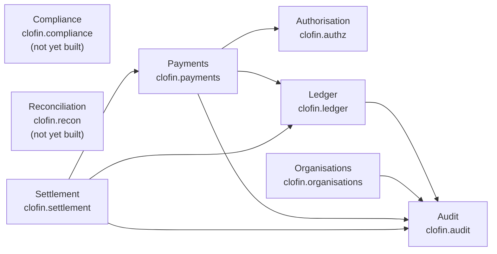

<!-- GENERATED FILE — do not edit by hand.
     Regenerate with `make diagrams`. `make diagrams-check` fails the build on drift.
     Generator: clofin.tools.diagrams, per ADR-0020 RULE 1 (generate, never draw). -->

# Bounded-context topology

> Generated from [`ARCHITECTURE.md` §3](../../ARCHITECTURE.md)'s table of contexts,
> with the arrows read from the `:require` clauses of the `ns` forms under `src/`,
> by `clofin.tools.diagrams`, per
> [ADR-0020](../ADR/0020-two-repositories-and-the-generate-replay-rules.md)
> RULE 1 — *generate, never draw*.

**Nodes come from the table; arrows come from the code.** `ARCHITECTURE.md` §3
states its dependency rule in prose, and RULE 1 has no exception for prose —
a diagram drawn from a sentence is a hand-drawn diagram with extra steps. The
`ns` forms are the machine-readable statement of the same fact, so they are
what is drawn. Reading this diagram against §3's paragraph is therefore a
check *on the paragraph*, and a useful one.

An arrow is a **declared** require that crosses a context boundary, read from
the source rather than from a loaded namespace: a transitive require through
some other namespace would draw an arrow the source does not contain. A
context marked *not yet built* has no source file under its namespace root.

