<!-- GENERATED FILE — do not edit by hand.
     Regenerate with `make diagrams`. `make diagrams-check` fails the build on drift.
     Generator: clofin.tools.diagrams, per ADR-0020 RULE 1 (generate, never draw). -->

# Control map

> Generated from [`COMPLIANCE.md` §2](../COMPLIANCE.md)
> by `clofin.tools.diagrams`, per
> [ADR-0020](../ADR/0020-two-repositories-and-the-generate-replay-rules.md)
> RULE 1 — *generate, never draw*.

```mermaid
flowchart LR
    subgraph status_enforced["✅ enforced"]
        direction TB
        c_01["C-01<br/>Segregation of duties"]
        c_02["C-02<br/>Dual authorisation proportionate to value"]
        c_03["C-03<br/>Immutable financial records"]
        c_04["C-04<br/>Ledger integrity"]
        c_05["C-05<br/>Complete and attributable audit trail"]
        c_06["C-06<br/>Duplicate payment prevention"]
        c_08["C-08<br/>Least privilege"]
        c_09["C-09<br/>Data minimisation<br/>(partial)"]
        c_10["C-10<br/>Change control over the schema"]
        c_12["C-12<br/>Supply chain control"]
        c_13["C-13<br/>Reconciliation integrity"]
    end
    subgraph status_partial["🔨 partial"]
        direction TB
        c_11["C-11<br/>Error handling that does not leak"]
    end
    subgraph status_designed_not_yet_built["📋 designed, not yet built"]
        direction TB
        c_07["C-07<br/>Sanctions screening before release"]
    end

    ep01["Deferred constraint trigger<br/>journal_entry_must_balance on journal_line ✅"]
    ep02["Deferred constraint trigger<br/>journal_entry_must_be_complete on<br/>journal_entry, checking line cardinality ≥ 2<br/>and per-currency balance at commit<br/>(migration 0008, after audit finding F-003)<br/>✅"]
    ep03["Integration test bypassing the domain layer<br/>entirely ✅"]
    ep04["Integration tests attempt both mutations<br/>directly in SQL and assert failure ✅"]
    ep05["Migration runner"]
    ep06["Primary key idempotency_key_pkey on<br/>(organisation_id, key)"]
    ep07["Property test over generated many-to-many<br/>postings ✅"]
    ep08["Review of :deps additions. (Not mechanical —<br/>stated honestly, and it is prospective: it<br/>enforces a policy on new direct<br/>dependencies, not an inventory of the<br/>resolved graph. A dependency review job in<br/>CI is a candidate improvement.)"]
    ep09["SELECT … FOR UPDATE in<br/>clofin.payments.repository/transition!"]
    ep10["State machine precondition"]
    ep11["actor_role.role_known"]
    ep12["approval_actor_live_key"]
    ep13["approval_no_delete"]
    ep14["approval_rejection_needs_reason"]
    ep15["approval_threshold / approver_limit check<br/>constraints"]
    ep16["audit_event_append_only"]
    ep17["audit_event_no_truncate"]
    ep18["case creation on a hit. (Increment 7.)"]
    ep19["clofin.api.approvals"]
    ep20["clofin.api.principal/authorise!"]
    ep21["clofin.audit.repository/assert-unit-of-work!"]
    ep22["clofin.audit.repository/assert-unit-of-work!<br/>in clofin.recon.service"]
    ep23["clofin.audit.repository/record!"]
    ep24["clofin.audit/event"]
    ep25["clofin.audit/event, actor rule"]
    ep26["clofin.authz.approval/evaluate"]
    ep27["clofin.authz.model/authorise!"]
    ep28["clofin.authz.model/role-permissions"]
    ep29["clofin.config/redacted with a test asserting<br/>the credential does not appear in the<br/>printed form ✅. Exception logging is outside<br/>both — see the statement above and §4."]
    ep30["clofin.error/public-data, with tests<br/>asserting that a credential embedded in an<br/>exception message does not appear in a<br/>production response and that a constraint<br/>name attached to a domain error appears in<br/>neither the response nor any profile ✅."]
    ep31["clofin.http.middleware/wrap-errors ✅"]
    ep32["clofin.http.middleware/wrap-request-logging<br/>✅"]
    ep33["clofin.idempotency.repository/execute-once!"]
    ep34["clofin.idempotency/canonical and /digest"]
    ep35["clofin.ledger.entry/entry raises with the<br/>per-currency shortfall ✅"]
    ep36["clofin.ledger.entry/reverse-entry refuses to<br/>reuse the original's id ✅"]
    ep37["clofin.ledger.purity-test"]
    ep38["clofin.payments.state/creator-only-events +<br/>clofin.payments.repository/transition!"]
    ep39["clofin.recon.adjustment/approvals-required"]
    ep40["clofin.recon.adjustment/transitions"]
    ep41["clofin.recon.break-state/transitions"]
    ep42["clofin.recon.matching-test"]
    ep43["clofin.recon.matching/rules"]
    ep44["clofin.recon.repository/mark-rejected!"]
    ep45["integration test tampering with a checksum<br/>and asserting start-up fails ✅."]
    ep46["journal_entry_append_only and<br/>journal_line_append_only triggers reject<br/>UPDATE, DELETE and TRUNCATE at the database<br/>✅ — the third verb added by migration 0007<br/>after audit finding F-002 found it uncovered<br/>✅"]
    ep47["recon_adjustment_posted_key"]
    ep48["recon_match_expectation_key"]
    ep49["recon_match_rule_known"]
    ep50["recon_statement_append_only,<br/>recon_statement_line_append_only,<br/>recon_match_append_only (and their TRUNCATE<br/>guards)"]
    ep51["recon_statement_replay_key and<br/>reconciliation_statement.content_digest"]
    ep52["reconciliation_break.assignee_id NOT NULL"]
    ep53["scheme_response_append_only,<br/>scheme_response_no_truncate"]
    ep54["scheme_response_replay_key and<br/>scheme_response.request_digest"]
    ep55["settlement_item_instruction_key"]

    c_01 --> ep19
    c_01 --> ep26
    c_01 --> ep28
    c_01 --> ep38
    c_02 --> ep12
    c_02 --> ep15
    c_02 --> ep26
    c_03 --> ep04
    c_03 --> ep36
    c_03 --> ep46
    c_04 --> ep01
    c_04 --> ep02
    c_04 --> ep03
    c_04 --> ep07
    c_04 --> ep35
    c_05 --> ep13
    c_05 --> ep16
    c_05 --> ep17
    c_05 --> ep21
    c_05 --> ep23
    c_05 --> ep24
    c_05 --> ep25
    c_05 --> ep37
    c_05 --> ep53
    c_06 --> ep06
    c_06 --> ep09
    c_06 --> ep33
    c_06 --> ep34
    c_06 --> ep54
    c_06 --> ep55
    c_07 --> ep10
    c_07 --> ep18
    c_08 --> ep11
    c_08 --> ep20
    c_08 --> ep26
    c_08 --> ep27
    c_09 --> ep29
    c_09 --> ep32
    c_10 --> ep05
    c_10 --> ep45
    c_11 --> ep30
    c_11 --> ep31
    c_12 --> ep08
    c_13 --> ep14
    c_13 --> ep22
    c_13 --> ep26
    c_13 --> ep39
    c_13 --> ep40
    c_13 --> ep41
    c_13 --> ep42
    c_13 --> ep43
    c_13 --> ep44
    c_13 --> ep47
    c_13 --> ep48
    c_13 --> ep49
    c_13 --> ep50
    c_13 --> ep51
    c_13 --> ep52
```

Each control carries the status its `COMPLIANCE.md` heading states, grouped by
the status vocabulary [§1](../COMPLIANCE.md) defines. The boxes on the right
are that control's **Enforcement point** entries, quoted as the document
writes them — a table's first column, a bullet, or a semicolon-separated
clause of a sentence. They are not shortened to the identifier inside them:
shortening *"Review of `:deps` additions. (Not mechanical — …)"* to its first
clause would draw a procedural control as a mechanical one, which is standing
lesson **L-14** exactly.

An enforcement point named by more than one control is one box with several
arrows into it. That is the thing the table in `COMPLIANCE.md` cannot show:
how much of the control set rests on a single function.

This is a map of what the document **claims**. It is not evidence that a
control holds; the enforcement points themselves are, and
[`COMPLIANCE.md`](../COMPLIANCE.md) names the test or constraint for each.

