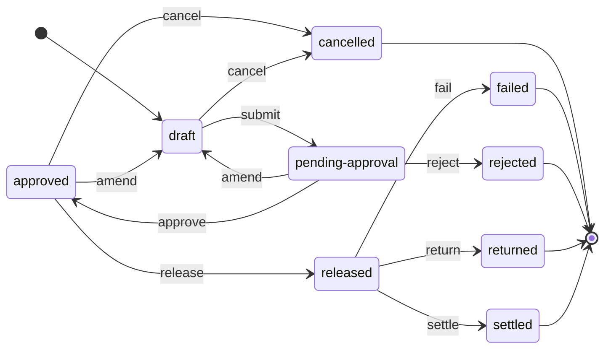

<!-- GENERATED FILE — do not edit by hand.
     Regenerate with `make diagrams`. `make diagrams-check` fails the build on drift.
     Generator: clofin.tools.diagrams, per ADR-0020 RULE 1 (generate, never draw). -->

# Payment instruction lifecycle

> Generated from `clofin.payments.state/transitions`
> by `clofin.tools.diagrams`, per
> [ADR-0020](../ADR/0020-two-repositories-and-the-generate-replay-rules.md)
> RULE 1 — *generate, never draw*.

Every state, every event and every permitted pair above is read from that
table. The terminal states — the ones with an arrow to `[*]` — are
**derived** through `clofin.payments.state/terminal?` rather than listed, so a
state that gains an outgoing transition stops being drawn as terminal in the
same commit that gives it one.

The rules that are *not* transitions — `mutable-states`, `reversible-states`
and `creator-only-events` — govern operations that leave the status where it
was, so they are no arrow on any diagram. They are stated in
[`DOMAIN_MODEL.md` §3](../DOMAIN_MODEL.md) beside this drawing.

