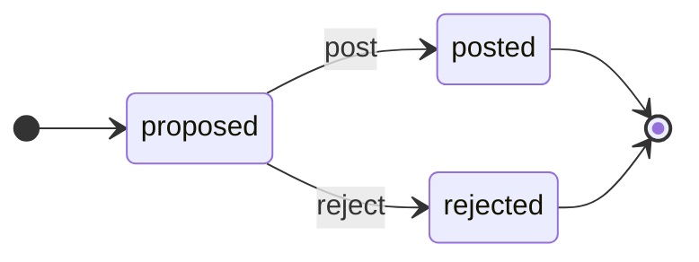

<!-- GENERATED FILE — do not edit by hand.
     Regenerate with `make diagrams`. `make diagrams-check` fails the build on drift.
     Generator: clofin.tools.diagrams, per ADR-0020 RULE 1 (generate, never draw). -->

# Reconciliation adjustment lifecycle

> Generated from `clofin.recon.adjustment/transitions`
> by `clofin.tools.diagrams`, per
> [ADR-0020](../ADR/0020-two-repositories-and-the-generate-replay-rules.md)
> RULE 1 — *generate, never draw*.

Every status, every event and every permitted pair above is read from that
table. The terminal statuses — the ones with an arrow to `[*]` — are
**derived** through `clofin.recon.adjustment/terminal?` rather than listed, so
a status that gains an outgoing transition stops being drawn as terminal in
the same commit that gives it one.

**Both endings are terminal, and they are not the same ending.** `post` puts a
balanced entry in the journal through the ordinary posting path and resolves
the break; `reject` records that an approver refused the correction, with a
reason, and leaves the break exactly where it was — so a different adjustment
may be raised against it. Counting one as the other would tell a reader that a
correction was made when one was declined.

**Each arrow has a driver.** `post` is driven by the transaction in which the
approvals an adjustment needs first exist, and `reject` by a `rejected`
decision on `POST /reconciliation-adjustments/{id}/approvals`. Until
[ADR-0025](../ADR/0025-two-audit-terms-for-changes-the-trail-did-not-carry.md)
the second arrow had no driver, so there was no status at the end of it: a
status nothing can reach is worse than an absent one.

How many approvals an adjustment needs is **not** on this diagram. It is a
number stored on the row at proposal, not a state, and
[`DOMAIN_MODEL.md` §2.4](../DOMAIN_MODEL.md) states it beside this drawing.

