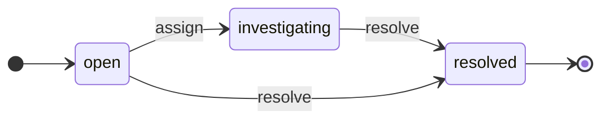

<!-- GENERATED FILE — do not edit by hand.
     Regenerate with `make diagrams`. `make diagrams-check` fails the build on drift.
     Generator: clofin.tools.diagrams, per ADR-0020 RULE 1 (generate, never draw). -->

# Reconciliation break lifecycle

> Generated from `clofin.recon.break-state/transitions`
> by `clofin.tools.diagrams`, per
> [ADR-0020](../ADR/0020-two-repositories-and-the-generate-replay-rules.md)
> RULE 1 — *generate, never draw*.

Every state, every event and every permitted pair above is read from that
table. The terminal state — the one with an arrow to `[*]` — is **derived**
through `clofin.recon.break-state/terminal?` rather than listed, so a state
that gains an outgoing transition stops being drawn as terminal in the same
commit that gives it one.

**Assignment is the transition.** A break becomes `investigating` by somebody
taking it on, so `assign` is one arrow rather than an ownership change beside a
state change. *Re*-assigning an already-investigating break leaves the state
where it is and is therefore no arrow at all: it is governed by
`reconciliation_break`'s `reassignable-states`, the same way `mutable-states`
governs amending a draft payment.

**`resolve` is driven by a posted adjustment and by nothing else.** There is no
written-off state, because nothing in this increment could drive one — and a
state with no driver is a promise the product does not keep.

A break's **age** is derived from its `openedAt` whenever it is read and is
stored nowhere, so it is not a state and appears on no diagram.

